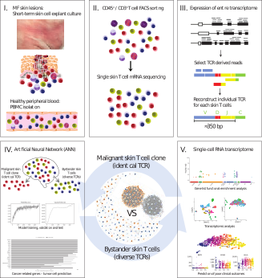

# TumorLymphocytes

Repository hosting analysis code for the paper 'HLA I shields tumor lymphocytes from NK-cell-mediated elimination in the skin'  
  
  

  

# Abstract

Cancer is associated with progressive impairment of cellular immunity. In mycosis fungoides (MF), the most common type of cutaneous T-cell lymphoma, even when blood disease responds favorably, tumoral skin lesions in the majority of patients are resistant to therapeutic monoclonal antibodies (mAbs) that target tumor cell surface antigens. In the present study, artificial neural network machine learning shows that human leukocyte antigen (HLA) I overexpression on tumor skin T cells inhibits natural killer (NK) cell activity and NK-mediated antibody-dependent cellular cytotoxicity (ADCC), thus conferring resistance to targeted therapies. Both HLA I blockade and KIR blockade (Ly49 blockade in mice) restored the ADCC and antitumoral activity of therapeutic mAbs in humans ex vivo and in mice both in vitro and in an in vivo T-cell lymphoma model, where it also reduced tumor volumes and significantly increased survival. We thus propose a novel tumor immune escape mechanism that accounts for impaired ADCC based on increased expression of HLA I on tumor skin T cells. 

# Authors & Contact
Chang Yun-Tsan <Yun-Tsan.Chang@chuv.ch>
Guenova-Hoetzenecker Emmanuella Emmanuella.Guenova-Hoetzenecker@chuv.ch
