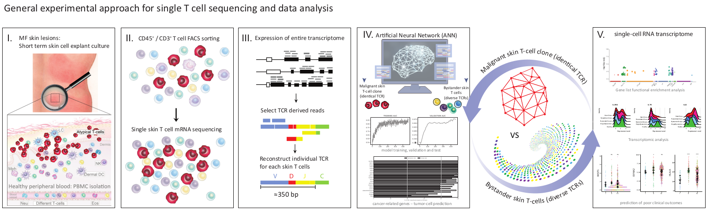

# TumorLymphocytes

[](https://zenodo.org/doi/10.5281/zenodo.10405927)  

Repository hosting analysis code for the paper 'MHC-I Upregulation Safeguards Neoplastic T Cell in the Skin Against NK Cell Eradication in Mycosis Fungoides'  
  
  


<p align="center">
  
</p>


# Abstract

Cancer-associated immune dysfunction is a major challenge for effective therapies. The emergence of antibodies targeting tumor cell-surface antigens led to remarkable advancements in the treatment of hematopoietic malignancies, particularly blood cancers. Yet their impact is constrained against tumors of hematopoietic origin manifesting in the skin. 
In this study, we employ a clonality-supervised deep learning methodology to dissect key pathological features implicated in mycosis fungoides, the most common cutaneous T-cell lymphoma. Our investigations unveil the prominence of the IL32β - major histocompatibility complex (MHC)-I axis as a critical determinant in tumor T-cell immune evasion within the skin microenvironment. Notably, in patients’ skin, we found MHC-I to detrimentally impact the functionality of natural killer (NK) cells, diminishing antibody-dependent cellular cytotoxicity and promoting resistance of tumor skin T-cells to cell-surface targeting therapies. Through murine experiments, we demonstrate that disruption of the MHC-I interaction with NK cell inhibitory Ly49 receptors restores NK cell anti-tumor activity and targeted T-cell lymphoma elimination in vivo. These findings underscore the significance of attenuating the MHC-I-dependent immunosuppressive networks within skin tumors. Overall, our study introduces a novel strategy to reinvigorate NK cell-mediated anti-tumor responses to overcome treatment resistance to existing cell-surface targeted therapies for skin lymphoma.

# Install dependencies 

```

if (!requireNamespace("BiocManager", quietly = TRUE))
  install.packages("BiocManager")
install.packages("Seurat")
install.packages("ggplot2")
install.packages("ggpubr")
install.packages("dplyr")

library(Seurat)
library("ggpubr")

```

# Installation time 
The installation time of all dependencies on a classical laptop with acceptable internet connexion should not exceed 1 hour.


# Version 

```
R version 4.3.0 (2023-04-21 ucrt)
Platform: x86_64-w64-mingw32/x64 (64-bit)
Running under: Windows 10 x64 (build 19045)

Matrix products: default


locale:
[1] LC_COLLATE=English_United States.utf8  LC_CTYPE=English_United States.utf8    LC_MONETARY=English_United States.utf8
[4] LC_NUMERIC=C                           LC_TIME=English_United States.utf8    

time zone: Europe/Zurich
tzcode source: internal

attached base packages:
[1] stats     graphics  grDevices utils     datasets  methods   base     

other attached packages:
[1] ggpubr_0.6.0       ggplot2_3.4.4      Seurat_5.0.1       SeuratObject_5.0.1 sp_2.1-2          

loaded via a namespace (and not attached):
  [1] deldir_2.0-2           pbapply_1.7-2          gridExtra_2.3          rlang_1.1.2            magrittr_2.0.3        
  [6] RcppAnnoy_0.0.21       matrixStats_1.1.0      ggridges_0.5.4         compiler_4.3.0         spatstat.geom_3.2-7   
 [11] png_0.1-8              vctrs_0.6.4            reshape2_1.4.4         stringr_1.5.1          pkgconfig_2.0.3       
 [16] fastmap_1.1.1          backports_1.4.1        ellipsis_0.3.2         utf8_1.2.4             promises_1.2.1        
 [21] purrr_1.0.2            jsonlite_1.8.7         goftest_1.2-3          later_1.3.1            spatstat.utils_3.0-4  
 [26] broom_1.0.5            irlba_2.3.5.1          parallel_4.3.0         cluster_2.1.5          R6_2.5.1              
 [31] ica_1.0-3              stringi_1.8.2          RColorBrewer_1.1-3     spatstat.data_3.0-3    reticulate_1.34.0     
 [36] car_3.1-2              parallelly_1.36.0      lmtest_0.9-40          scattermore_1.2        Rcpp_1.0.11           
 [41] tensor_1.5             future.apply_1.11.0    zoo_1.8-12             sctransform_0.4.1      httpuv_1.6.12         
 [46] Matrix_1.6-3           splines_4.3.0          igraph_1.5.1           tidyselect_1.2.0       rstudioapi_0.15.0     
 [51] abind_1.4-5            spatstat.random_3.2-1  codetools_0.2-19       miniUI_0.1.1.1         spatstat.explore_3.2-5
 [56] listenv_0.9.0          lattice_0.22-5         tibble_3.2.1           plyr_1.8.9             withr_2.5.2           
 [61] shiny_1.8.0            ROCR_1.0-11            Rtsne_0.16             future_1.33.0          fastDummies_1.7.3     
 [66] survival_3.5-7         polyclip_1.10-6        fitdistrplus_1.1-11    BiocManager_1.30.22    pillar_1.9.0          
 [71] carData_3.0-5          KernSmooth_2.23-22     plotly_4.10.3          generics_0.1.3         RcppHNSW_0.5.0        
 [76] munsell_0.5.0          scales_1.3.0           globals_0.16.2         xtable_1.8-4           glue_1.6.2            
 [81] lazyeval_0.2.2         tools_4.3.0            data.table_1.14.8      RSpectra_0.16-1        ggsignif_0.6.4        
 [86] RANN_2.6.1             leiden_0.4.3.1         dotCall64_1.1-1        cowplot_1.1.1          grid_4.3.0            
 [91] tidyr_1.3.0            colorspace_2.1-0       nlme_3.1-164           patchwork_1.1.3        cli_3.6.1             
 [96] spatstat.sparse_3.0-3  spam_2.10-0            fansi_1.0.5            viridisLite_0.4.2      dplyr_1.1.4           
[101] uwot_0.1.16            gtable_0.3.4           rstatix_0.7.2          digest_0.6.33          progressr_0.14.0      
[106] ggrepel_0.9.4          htmlwidgets_1.6.4      htmltools_0.5.7        lifecycle_1.0.4        httr_1.4.7
```

# Input data

Raw data from single-cell RNA seq related to this article can be found with the GEO accession number GSE224449 at Gene Expression Omnibus by the National Center for Biotechnology information.
For the re-analysis of public scRNA skin lesion datasets, the data are publicly available:
 
 * mycosis fungoides [MF: [GSE173205](https://www.ncbi.nlm.nih.gov/geo/query/acc.cgi?acc=GSE173205) (Rindler, K., et al. Single-cell RNA sequencing reveals markers of disease progression in primary cutaneous T-cell lymphoma. Molecular Cancer 20, 124 (2021)) and [GSE165623](https://www.ncbi.nlm.nih.gov/geo/query/acc.cgi?acc=GSE165623) (Rindler, K., et al. Single-Cell RNA Sequencing Reveals Tissue Compartment-Specific Plasticity of Mycosis Fungoides Tumor Cells. Front Immunol 12, 666935 (2021))]
 * atopic dermatitis [AD: [GSE222840](https://www.ncbi.nlm.nih.gov/geo/query/acc.cgi?acc=GSE222840) (Alkon, N., et al. Single-cell RNA sequencing defines disease-specific differences between chronic nodular prurigo and atopic dermatitis. J Allergy Clin Immunol (2023))]
 * basal cell carcinoma [BCC: [GSE181907](https://www.ncbi.nlm.nih.gov/geo/query/acc.cgi?acc=GSE181907) (Yerly, L., et al. Integrated multi-omics reveals cellular and molecular interactions governing the invasive niche of basal cell carcinoma. Nature Communications 13, 4897 (2022))]
 * cutaneous B-cell lymphoma [CBCL: [GSE173820](https://www.ncbi.nlm.nih.gov/geo/query/acc.cgi?acc=GSE173820) (Jonak, C., et al. Single-cell RNA sequencing profiling in a patient with discordant primary cutaneous B-cell and T-cell lymphoma reveals micromilieu-driven immune skewing. Br J Dermatol 185, 1013-1025 (2021))].


# Others
Note that he the neural network logistic regression (NN-log-reg) model is available online at https://github.com/suskim/NN-log-reg.git

# How to cite this material
Please cite the following DOI: [10.5281/zenodo.10405928](DOI) and 'MHC-I Upregulation Safeguards Neoplastic T Cell in the Skin Against NK Cell Eradication in Mycosis Fungoides', Chang et al., Nature Communications (2023)

# Authors & Contact
Chang Yun-Tsan <Yun-Tsan.Chang@chuv.ch>  
Guenova-Hoetzenecker Emmanuella <Emmanuella.Guenova@unil.ch>  
Prompsy Pacome <pacome.prompsy@chuv.ch>
